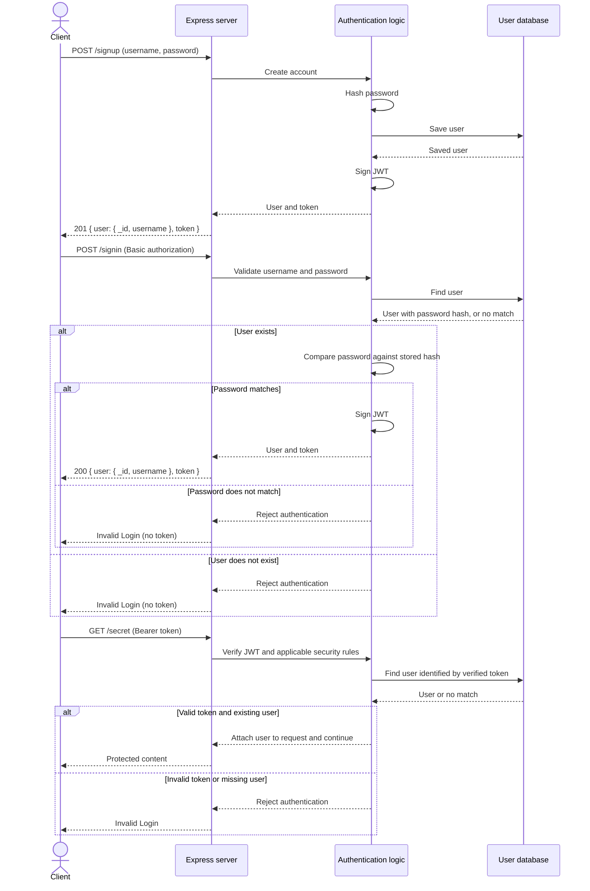

# bearerAuth

Use of JWToken to re-authenticate users; restricting access to any protected route that requires a valid login to access.

## Local setup

Requires Node.js and a running PostgreSQL server.
Development was verified with Node.js 20.20.2 and PostgreSQL 16.

1. Run `npm ci`.
2. Create a PostgreSQL database named `bearer_auth`.
3. Copy `.env.example` to `.env`.
4. Set your database connection and a randomly generated signing secret.
5. Run `npm run dev`.

Generate a signing secret:

```bash
node -e "console.log(require('crypto').randomBytes(32).toString('hex'))"
```

Keep `.env` private. The server creates its tables on startup.
The default address is `http://localhost:3000`.

## Routes

| Method | Path | Authentication | Successful response |
| --- | --- | --- | --- |
| POST | `/signup` | None; JSON username/password | 201, public user data and token |
| POST | `/signin` | Basic username/password | 200, public user data and token |
| GET | `/users` | Bearer token | 200, usernames |
| GET | `/secret` | Bearer token | 200, protected message |

Send tokens using `Authorization: Bearer TOKEN`.
Invalid Basic or Bearer credentials receive `403 Invalid Login`.

## UML



- **Client** (browser or REST client) makes request.
- **Server** (Express) receives and directs to appropriate route.
- **Authentication Logic** verifies credentials / token's signature & confirms its representation of an existing user. (runs inside server)
  - decoding a token does not in of itself establish trust.
  - Passwords and hashes are to be kept out of JWT and the response object.
  - JWT signatures indicates authenticity of content and/or whether tampering has occured; Signing protects authenticity and integrity; it does not encrypt or hide the contents.
- **User DB** stores usernames and password hashes, not plaintext passwords.

===

- Diagram depicts three different request scenarios.
  - `/signup`: username and password sent to POST /signup;
    - password hashed by server before storing user.
    - Server creates JWT after saving user and returns `user` object.
    - goals are `201` (account created) and JWT.
  - `/signin`: credentials sent through `Authorization` header to `POST /signin` (using basicAuth format);
    - server finds `user` object and compares password to stored hash; =/= decrypt.
    - if credentials match; JWT is created by server and `200` response returned.
    - ***(If the user does not exist or the password does not match, the server responds with `"Invalid Login"` and does not create a token.)***
  - `/secret`, a protected request, uses bearerAuthen middleware to check token before the route can respond and gain access.
    - signature is checked to verify authenticity and ensure contents have not been altered.
    - restrictions are checked, if any (expiration, etc.).
    - locate user that matches token identity.

===

- Passing all checks; middleware attaches user to `req.user` and calls `next()`. Allowing Express to continue to protected route handler.
  - Server responds with `"Invalid Login"` from failing checks.
- Bearer token must be included on every request to a protected route by bearerAuthen, no exception.

## Token security

- Tokens expire after 15 minutes when `JWT_EXPIRATION_ENABLED=true`.
  Verification requires an expiration and limits token age to 15 minutes.
- Issuer and audience validation are enabled by `JWT_CONTEXT_ENABLED=true`.
  Expected values come from `JWT_ISSUER` and `JWT_AUDIENCE`.
- Both protections are enabled in the example development configuration.
  Set either flag to `false` to disable that optional policy.
- Tokens already carrying an expired `exp` remain invalid.
- After enabling these policies, sign in again to obtain a compatible token.
- JWTs are signed, not encrypted. These protections do not provide logout
  revocation or single-use tokens.

Reference: [jsonwebtoken signing and verification options](https://github.com/auth0/node-jsonwebtoken/blob/v8.5.1/README.md#usage).

Run the unchanged starter tests and additional security tests together:

```bash
JWT_EXPIRATION_ENABLED=false JWT_CONTEXT_ENABLED=false npm test -- --runInBand
```

## Links

- [Repository](https://github.com/tonch-LIV/bearerAuth)
- [GitHub Actions](https://github.com/tonch-LIV/bearerAuth/actions)
- Submission PR: pending
- Deployment: not included; application verified locally.
  
## Changelog

- added [UML](#uml) depicting how `bearerAuth` will check for a token for later requests rather than for credentials.
- starter code from [class repo](https://github.com/jtimm-gicw/Code-401-PDX/tree/main/class-07) imported over.
- installed dependencies from `package.json`; `npm install` -> creating `node_modules` and `package-lock.json`.  

===

- ran `[npm test -- --runInBand]` to confirm test failures from starterCode.  
- **`src/auth/router/handlers.js`**;
  - `.text` -> `.send` response method; `handleSecret()`.
  - `Users` =/= `users` (import), and `.map()` is to be used on `userRecords` since that is the array returned from query; `handleGetUsers()`.
  - proper use of `req` parameter (!`request`); `handleSignin()`.
  - test expects `201` for succesful `/signup`; `handleSignup()`.
- **`src/auth/models/users.js`**;
  - added missing import to allow `jwt.sign()` and `jwt.verify` access to library; `require('jsonwebtoken');`
  - passed `process.env.SECRET` as signing key in the return, which is separate to the payload ; `userSchema.token.get()`.
  - updated `hashedPass` to wait and obtain hash before assigning `user.password`; `model.beforeCreate()`.
  - added config for 15-min token creation and issuer/audience verification; `token.get()` and `model.authenticateToken()`, and `.env.example`.
  - specified **which** user to find; `where: `. return of user per successful hash-to-password comparison; `model.authenticateBasic()`.
  - removed redundant `try / catch`, verified JWT signatures and payload usernames, awaiting matching user lookup / rejecting missing users; `model.authenticateToken();`.
  - user responses limited to id's and username, keeping password hashes internal; `model.prototype.toJSON()`.
- **`src/auth/middleware/basic.js`**;
  - changed import `users` to match with export from source.
  - header checks reject missing credentials, wrong authentication scheme, or extra parts.
  - failures receive the same 403 response.
  - if successfull, authen user held by `req.user`, and `next()` lets the `/signin` handler run.
- **`src/auth/middleware/bearer.js`**;
  - follows `basic.js` structure; extracts & validates Bearer headers -> calls matching model method, `authenticateToken()` -> attach authen user and submitted token; `req.user` and `req.token` -> if success, call `next()`. 
- **`index.js`**;
  - matched startup call in `index.js` to `server.js` exporting `startup()`, supplied explicit port fallback.
- **`src/auth/models/index.js`**;
  - `console.log` as logging fucntion; `case 'development':`.
  - configured SQLite with explicit options for `dialect` and `storage` to bypass connection-string parsing; `case 'test': db_config` & `Sequelize` constructor.
- Verified server startup and rejection of request w/o token; `index.js`, `GET /secret` returned `403 Invalid Login`.
- Configured local PostgreSQL connection, server port, and JWT signing secret; `.env` and DB `bearer_auth`.
- `.env.example` created for documentation on settings needed for others.
- Verified signin, repeated Bearer access, rejection of invalid credentials/tokens, and account persistence across server restart; `POST /signin`, `GET /secret`, and PostgreSQL.
- added public identifier variables; `.env`.
- `__tests__/src/auth/token-security.test.js` file.
  - added to check valid tokens, as well as; expired, tokens missing expiration, wrong context, and acceptance with both optional protections disabled; `jwt.decode()` used only to inspect, never authenticate; expire token test creates already expired token to avoid waiting 15m.
  - starter tests use compatibility settings; additional security tests explicitly enable and verify the protections.
- **`.github/workflows/ci.yml`**
  - automated tests to check pushes to `dev`/`main` and pull request's that target `main`.
  - Uses tested Node ver.
  - Tests use SQLite in memory (does not need PostgreSQL or `.env`).
- Included the dependency lockfile for reproducible CI installs; `package-lock.json` and `.gitignore`.
- **`README.md`**;
  - Documented local setup, routes, and submission links.